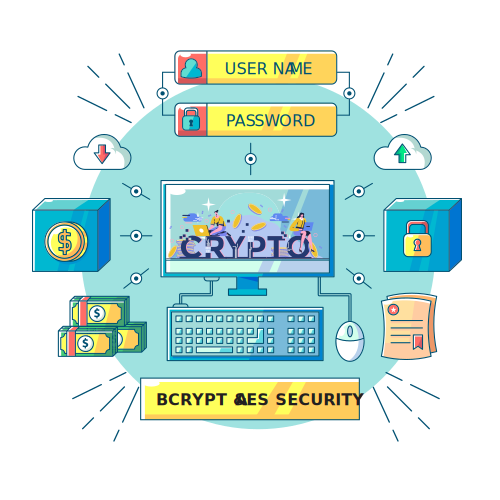

<h1 align="center">
  
  <br>
  <b>CRYPTO - APP</b>
</h1>

<p align="center">
<!-- JAVA -->
  
  
  <!-- MYSQL -->
  
  
    <!-- NETBEANS -->
  
  
  <br>
  <!-- DETAIL APP -->
  &nbsp;
  &nbsp;
  
</p>

Aplikasi **keamanan file berbasis Java Desktop** yang berfungsi untuk melakukan **enkripsi dan dekripsi file menggunakan algoritma AES (Advanced Encryption Standard)** dengan mode **CBC**, serta **pengamanan password menggunakan BCrypt**. Aplikasi ini dilengkapi dengan **manajemen user, logging, dan statistik performa enkripsi**.

---

## 🚀 Fitur Utama

- 🔒 Enkripsi & Dekripsi File (AES-CBC)
- 🔑 Hashing Password menggunakan **BCrypt**
- 👤 Sistem Login & Register User
- 🗂️ Manajemen File (upload, encrypt, decrypt)
- 📊 Statistik & Grafik Performa AES
- 📝 Logging hasil pengujian enkripsi
- 💾 Integrasi Database MySQL

---

## 🛠️ Teknologi & Tools

**Bahasa & Platform**

- Java (JDK 8+)
- Java Swing (GUI Desktop)

**Keamanan & Kriptografi**

- AES (CBC Mode)
- BCrypt (jbcrypt)

**Database**

- MySQL
- JDBC (MySQL Connector)

**Library Tambahan**

- Apache POI (Excel handling)
- iTextPDF (PDF handling)
- JFreeChart (Grafik & Statistik)
- Log4j (Logging)

---

## 🖼️ Dokumentasi Tampilan Aplikasi

| Fitur           | Preview                   |
| --------------- | ------------------------- |
| Login           | `src/assets/login.png`    |
| Register        | `src/assets/register.png` |
| Dashboard User  | `src/assets/user.png`     |
| Admin Panel     | `src/assets/admin.png`    |
| Logo / Branding | `src/assets/ALS.png`      |

> 📌 Gambar dapat dilihat langsung pada folder `src/assets/`

---

## 📂 Struktur Folder Utama

```
crypto-file-aes-bcrypt-main/
│
├── src/
│   ├── aes/              # Utilitas AES
│   ├── controller/       # Logic aplikasi
│   ├── view/             # Tampilan GUI (Swing)
│   ├── config/           # Koneksi database
│   └── assets/           # Gambar & asset UI
│
├── lib/                  # Library (.jar)
├── sample/               # File uji coba
├── hasil_pengujian/      # Grafik & log hasil tes
├── file_encrypt/         # Output file terenkripsi
├── file_decrypt/         # Output file dekripsi
├── kriptografi_db.sql    # Struktur database
└── README.md
```

---

## ⚙️ Cara Menjalankan Aplikasi (Step-by-Step)

### 1️⃣ Persiapan Environment

- Install **Java JDK 8 atau lebih baru**
- Install **MySQL Server**

---

### 2️⃣ Setup Database

1. Buat database di MySQL
2. Import file berikut:

   ```
   kriptografi_db.sql
   ```

3. Sesuaikan konfigurasi database di:

   ```
   src/config/DatabaseConnection.java
   ```

---

### 3️⃣ Jalankan Aplikasi

#### Opsi A – Menggunakan IDE (Disarankan)

- Buka project menggunakan **IntelliJ IDEA / NetBeans / Eclipse**
- Tambahkan seluruh file `.jar` di folder `lib/` ke **Build Path**
- Jalankan file utama:

  ```
  src/view/LoginRegisterFrame.java
  ```

#### Opsi B – Compile Manual (CLI)

```bash
javac -cp "lib/*" src/**/*.java
java  -cp "lib/*;src" view.LoginRegisterFrame
```

---

## 🧪 Pengujian

- File uji tersedia di folder `sample/`
- Hasil enkripsi/dekripsi otomatis tersimpan di:
  - `file_encrypt/`
  - `file_decrypt/`

- Statistik dan grafik performa AES tersedia di:
  - `hasil_pengujian/`

---

## 📌 Catatan

- Aplikasi ini ditujukan untuk **pembelajaran dan penelitian kriptografi**
- Mendukung berbagai format file: **.txt, .pdf, .xlsx, dll**

---

## 👨‍💻 Author

Dikembangkan untuk kebutuhan **Keamanan Informasi & Kriptografi File**.

---

⭐ Jika project ini membantu, jangan lupa beri **star** di GitHub!
